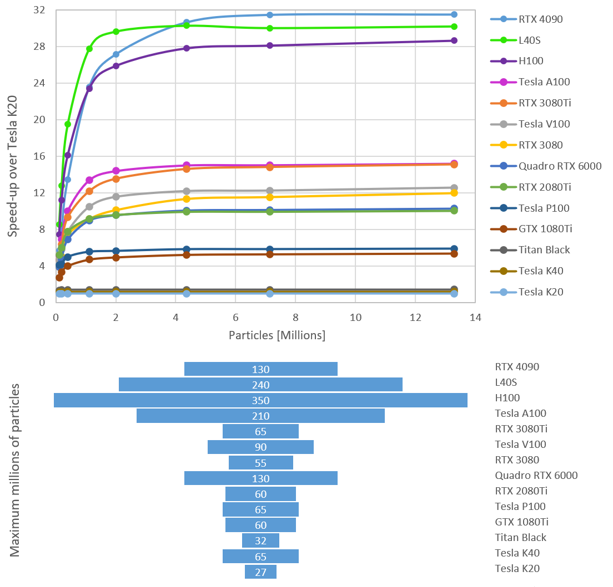

<h1 align="center">
   
  
   
  DualSPHysics performance test
   
</h1>

<h4 align="center"><a href="http://www.dual.sphysics.org" target="_blank">DualSPHysics</a> is based on the Smoothed Particle Hydrodynamics model named <a href="http://www.sphysics.org" target="_blank">SPHysics</a>.</h4>

This repository contains the source code of **DualSPHysics v5.0.112** along with a set of scripts developed to systematically evaluate and compare the performance of various GPU models. These performance tests have been conducted on both Windows and Linux systems starting from the year 2022.

This benchmarking framework and the relative performance values are based on the methodology and results presented in <a href="https://rdcu.be/chIPC" target="_blank">Domínguez et al. (2022)</a>.

# Latest GPU Benchmark Comparison

The following graph shows the latest comparative performance evaluation of NVIDIA GPU cards. The results are presented as speedup relative to Tesla K20 (further details of the test case in <a href="https://rdcu.be/chIPC" target="_blank">Domínguez et al. (2022)</a>).
These tests have been carried out using the benchmarking scripts included in this repository.
<h1 align="center">
  
</h1>

# Building the project

## Microsoft Windows

This application is being developed in Visual Studio Community 2022 since it is free and compatible with CUDA 11.7 (<a href="https://www.visualstudio.com/vs/older-downloads/" target="_blank">download web</a>). The repository contains project files.

Make sure that you install the CUDA SDK beforehand if you want to compile the GPU version, and configure the Visual Studio project to point to the CUDA libraries directory to compile (now prepared for CUDA 11.7).

You can also use the [Makefile](src/source/Makefile). It is possible that you'll need to edit it. Check the GNU/Linux guide on how to compile if you're using the makefile, as it is mostly the same, just installing the things manually by yourself.

## GNU/Linux

### Using Makefile

You can build the project in GNU/Linux using the [Makefile](src/source/Makefile) included in the source folder.
Edit the `Makefile` file with a text editor and then:
   * Set the `DIRTOOLKIT` variable with the path to CUDA in your system e.g. `DIRTOOLKIT=/opt/cuda`
   * Make sure that your `G++` compiler version is compatible with the CUDA version installed in your system (e.g. CUDA 11.7 supports G++ versions up to 11.x). If you want to use an specific version, you should modify the variable `CC`, for example: `CC=/usr/local/bin/g++-11`

After compiling you should see a message like `--- Compiled Release GPU/CPU version ---`. Go to `bin/linux/` to check that `DualSPHyiscs_linux64` is there and build correctly.

# Contributing

We welcome contributions involving performance results from new GPU hardware to enrich and extend this repository. Researchers and developers interested in contributing such data are encouraged to contact [Dr José M. Domínguez](mailto:jmdalonso@gmail.com) or  [Dr Iván Martínez-Estévez](mailto:ivan.martinez.estevez@uvigo.es) for further collaboration and coordination.

# Authors and people involved

Visit the updated list of [developers](https://dual.sphysics.org/developers/).

# References

- J.M. Domínguez, G. Fourtakas, C. Altomare, R.B. Canelas, A. Tafuni, O. García-Feal, I. Martínez-Estévez, A. Mokos, R. Vacondio, A.J.C. Crespo, B.D. Rogers, P.K. Stansby, M. Gómez-Gesteira. 2022. **DualSPHysics: from fluid dynamics to multiphysics problems**. Computational Particle Mechanics, 9(5): 867–895. doi:<a href="https://doi.org/10.1007/s40571-021-00404-2" target="_blank">10.1007/s40571-021-00404-2</a>. <a href="https://rdcu.be/chIPC" target="_blank">-Open access-</a>
